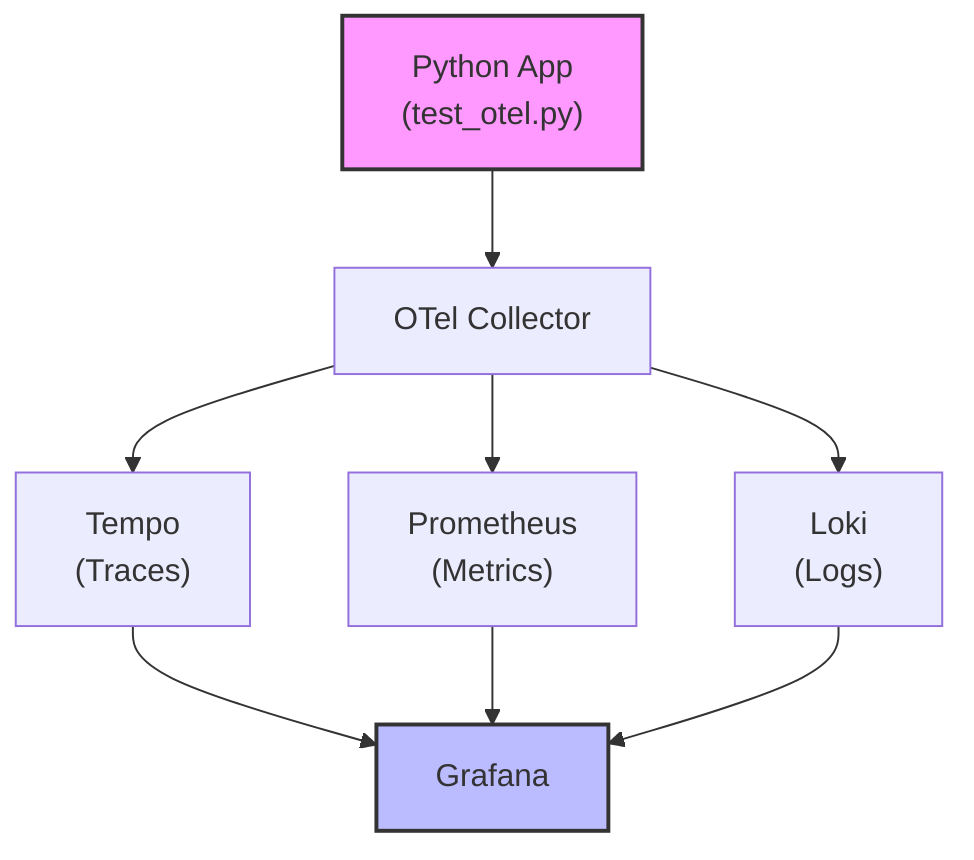

# OpenTelemetry Stack Example

This project demonstrates how to set up and test an OpenTelemetry (OTel) stack locally using Docker Compose. It includes a Python script to generate and send telemetry data to an OpenTelemetry Collector, with traces viewable in Grafana via Tempo.

## Project Structure

- `test_otel.py` — Python script to generate and send test telemetry data (traces) to the OTel Collector.
- `docker-compose.yml` — Docker Compose file to spin up the OTel Collector, Tempo, Loki, Prometheus, and Grafana.
- `otelcol/otelcol.yaml` — Configuration for the OpenTelemetry Collector.
- `tempo/tempo.yaml` — Configuration for Tempo (distributed tracing backend).
- `prometheus/prometheus.yml` — Configuration for Prometheus (metrics backend).
- `loki/loki-local.yaml` — Configuration for Loki (logs backend).
- `grafana/provisioning/datasources/` — Auto-provisioning configuration for Grafana data sources.
- `otel_test_env/` — Python virtual environment for dependencies.

---



---

## Features

✅ **Auto-configured Grafana Data Sources** - Prometheus, Tempo, and Loki are automatically configured in Grafana with cross-correlations:
- **Prometheus** (metrics) → **Tempo** (traces) via exemplars
- **Tempo** (traces) → **Loki** (logs) and **Prometheus** (metrics) 
- **Loki** (logs) → **Tempo** (traces) via trace IDs

✅ **Full Observability Stack** - Complete setup with metrics, traces, and logs collection and visualization

✅ **Ready-to-use** - No manual data source configuration required

## Prerequisites

- [Docker](https://www.docker.com/get-started)
- [Docker Compose](https://docs.docker.com/compose/)
- Python 3.8+

## Getting Started

### 1. Clone the Repository

```bash
git clone <your-repo-url>
cd otel-stack
```

### 2. Start the Observability Stack

This will start the OTel Collector, Tempo, Loki, Prometheus, and Grafana with **auto-configured data sources**:

```bash
docker compose up -d
```

**Available Services:**
- **Grafana:** [http://localhost:3000](http://localhost:3000) (admin/admin) - *Data sources pre-configured*
- **OpenTelemetry Collector:** `localhost:4317` (gRPC), `localhost:8888` (metrics)
- **Tempo:** [http://localhost:3200](http://localhost:3200) (tracing backend)
- **Prometheus:** [http://localhost:9090](http://localhost:9090) (metrics backend)  
- **Loki:** [http://localhost:3100](http://localhost:3100) (logs backend)

### 3. Set Up Python Environment

It is recommended to use the provided virtual environment (`otel_test_env/`). If you need to recreate it:

```bash
python3 -m venv otel_test_env
source otel_test_env/bin/activate
pip install -r requirements.txt  # If requirements.txt is present
```

Or manually install dependencies:

```bash
pip install opentelemetry-sdk opentelemetry-exporter-otlp-proto-grpc
```

### 4. Run the Test Telemetry Script

With the stack running and your Python environment activated:

```bash
python test_otel.py
```

You should see output indicating that telemetry data was sent.

### 5. View Traces in Grafana

1. Open Grafana at [http://localhost:3000](http://localhost:3000)
2. Log in (default: `admin` / `admin`)
3. **Data sources are pre-configured!** Navigate to **Explore** and choose:
   - **Tempo** - for distributed tracing
   - **Prometheus** - for metrics and exemplars
   - **Loki** - for logs with trace correlation
4. Search for traces from the `test-service` or explore metrics and logs

**Cross-correlation features:**
- Click on trace exemplars in Prometheus to jump to Tempo traces
- From Tempo traces, navigate to related logs in Loki
- From Loki logs, click trace IDs to view traces in Tempo

## Customization

- **Change Service Name:** Edit `test_otel.py` and modify the `service.name` in the `Resource.create` call.
- **Collector Endpoint:** Ensure the `endpoint` in `OTLPSpanExporter` matches your OTel Collector address.
- **Add More Spans:** Extend `test_otel.py` to generate more complex traces.
- **Modify Data Sources:** Edit `grafana/provisioning/datasources/datasources.yaml` to customize data source configurations.

## Example Grafana Dashboards

To help you get started visualizing your telemetry, example dashboards are provided:

- **Tempo Traces Overview:** Search and view traces from Tempo.
- **Prometheus Metrics Overview:** Visualize request rate and latency metrics.
- **Loki Logs Overview:** Stream logs from the test-service.

Dashboards are located in `grafana/provisioning/dashboards/`.

### Importing Dashboards

1. Open Grafana at [http://localhost:3000](http://localhost:3000)
2. Go to **Dashboards > Manage > Import**
3. Upload the desired JSON file from `grafana/provisioning/dashboards/`
4. Select the appropriate data source if prompted

You can also configure Grafana to auto-import these dashboards by updating the provisioning config (see Grafana docs).

## Troubleshooting

- **No Traces in Grafana:**
  - Ensure all containers are running: `docker compose ps`
  - Check logs for the OTel Collector: `docker compose logs otelcol`
  - Ensure the Python script is using the correct endpoint and port.
  - Verify Grafana provisioning: `docker compose logs grafana`
- **Port Conflicts:**
  - Make sure the required ports (3000, 4317, 3200, 9090, 3100) are free.
- **Data Source Issues:**
  - Check that all services are healthy and accessible from within the Docker network.

## References

- [OpenTelemetry Python Docs](https://opentelemetry.io/docs/instrumentation/python/)
- [Grafana Tempo](https://grafana.com/oss/tempo/)
- [OpenTelemetry Collector](https://opentelemetry.io/docs/collector/)
- [Grafana Loki](https://grafana.com/oss/loki/)
- [Prometheus](https://prometheus.io/)

---

**Author:** Your Name

**License:** MIT (or specify your license)